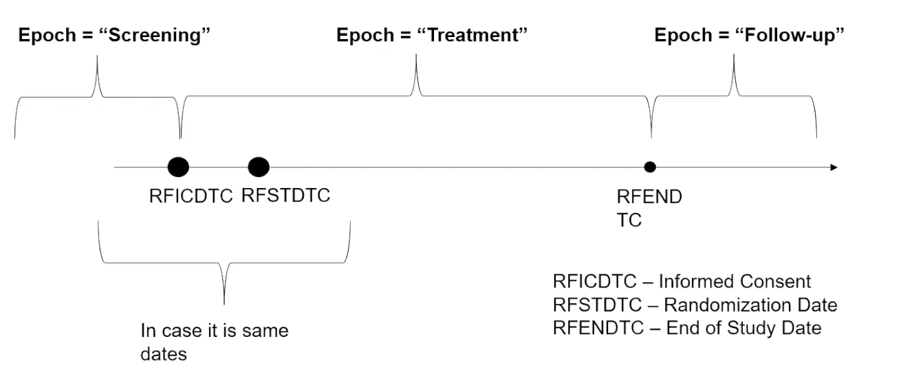
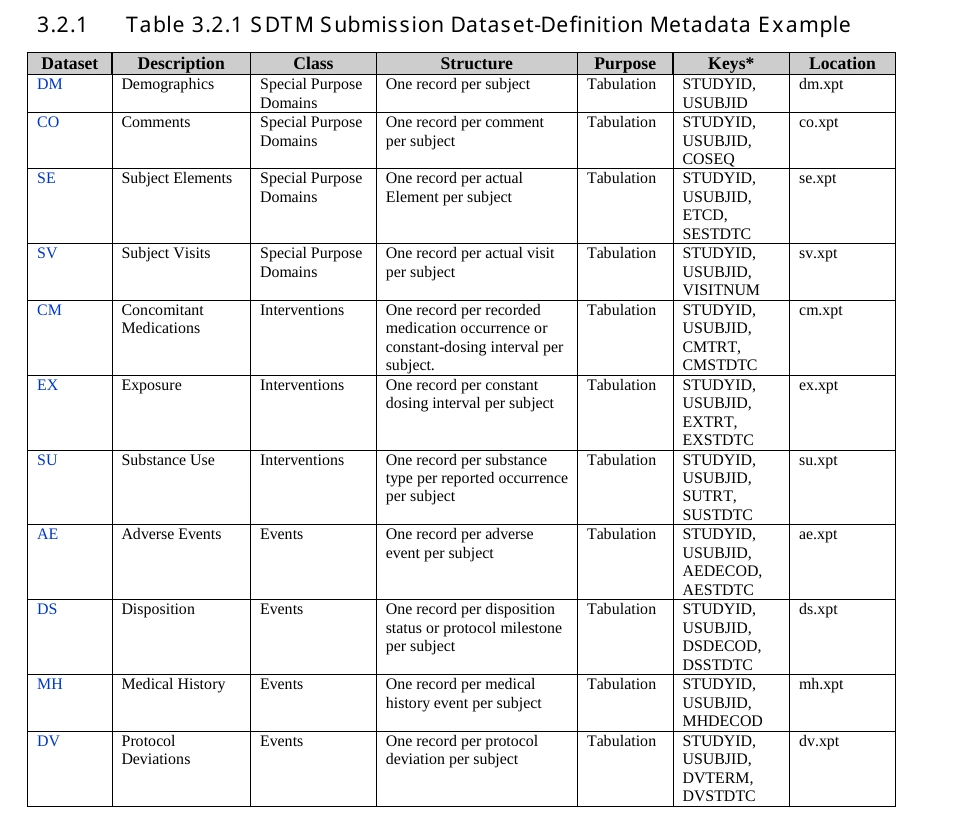
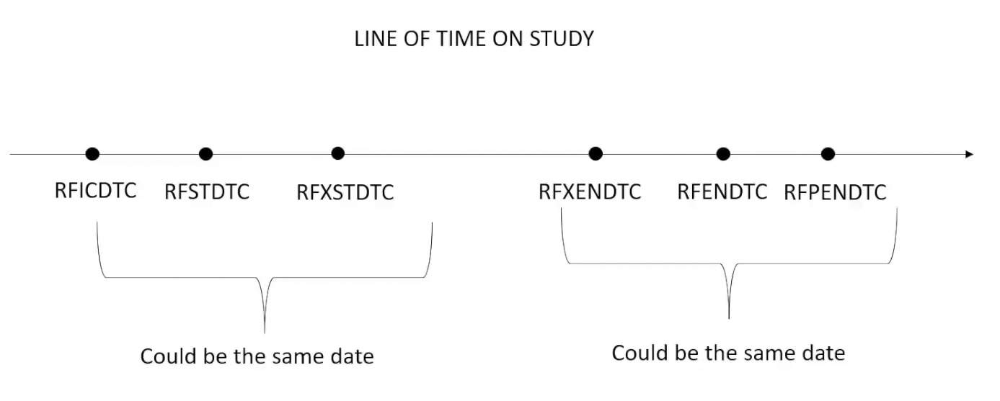
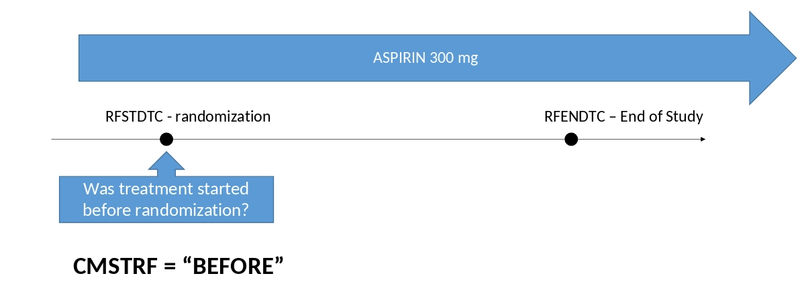
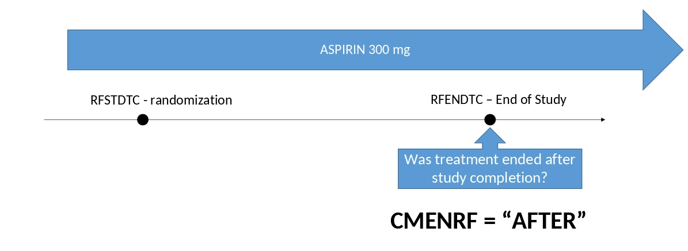
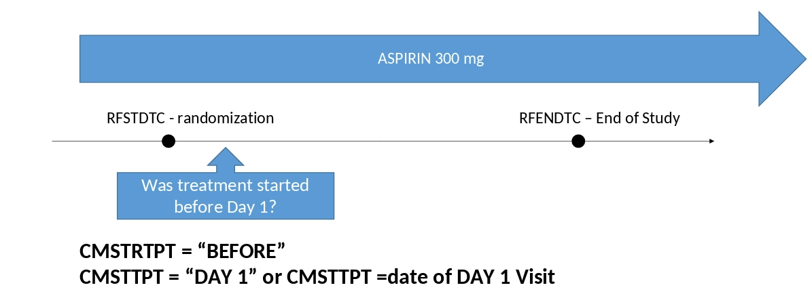
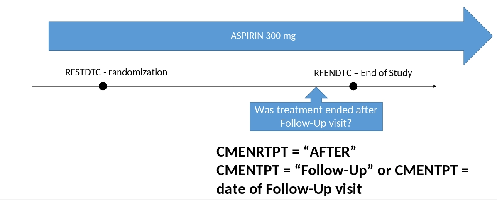

# Спільні правила для створення SDTM

## Обмеження

- Dataset Label - не більше 40 символів
- Variable Name - не більше 8 символів
- Variable Label - не більше 40 символів
- Variable Content - не більше 200 символів

## Спільні змінні

| Змінна | Опис | Додаткова інформація |
| :--- | :--- | :--- |
| **—CD** | Код | Це коротка, комп'ютерна версія значення змінної (наприклад, ARM = "Placebo", ARMCD = "PBO") |
| **—DY** | Study Day | Порядковий номер дня відносно початку лікування (RFSTDTC). Ці змінні не можуть дорівнювати нулю. Якщо трапилось в день рандомізації, то додаємо 1. |
| **—FL** | Флаг | Використовується для змінних-індикаторів, які відповідають на питання "Так чи Ні?". Зазвичай дорівнює або "Y", або NULL |
| **—SEQ** | Унікальний номер запису | В рамках одного суб’єкта. |
| **—GRPID** | Групування | Використовується для групування записів. |
| **—REFID** | Зв’язок записів | Для зв’язку записів між різними датасетами. |
| **—SPID** | Номер від спонсора | Номер запису від спонсора. Може братися з CRF. |
| **—STRF** | Початок події | Використовується, щоб показати, що подія тривала на момент початку участі пацієнта (RFSTDTC). |
| **—STRTPT** | Статус на момент STTPT | Показує статус івенту на момент STTPT. |
| **—STTPT** | Reference дата | Точка відліку для початку (Reference Time Point). |
| **—ENRF** | Завершення події | Використовується, щоб показати, що подія тривала на момент завершення участі пацієнта (RFENDTC). |
| **—ENRTPT** | Статус на момент ENTPT | Показує статус івенту на момент ENTPT. |
| **—ENTPT** | Reference дата | Точка відліку для завершення (Reference Time Point). |
| **—CAT** | Категорія | Загальна категорія даних. |
| **—SCAT** | Сабкатегорія | Додаткова підкатегорія. |
| **VISIT** | Назва візиту | Назва візиту за протоколом. |
| **VISITNUM** | Номер візиту | Числовий порядок візиту. |
| **VISITDY** | Плановий Study Day | Запланований день візиту. Створюється, тільки якщо ця інформація є в протоколі. |
| **—DRFL** | Derived Flag | Флаг для позначення, що запис був задерайвлений. Не рекомендується робити на рівні SDTM. |
| **EPOCH** | Назва інтервалу | Назва інтервалу часу між основними майлстонами (Phase/Period). |

## Ключові змінні датасетів

## Reference дати

### STRF

Відносно RFSTDTC

### ENRF

Відносно RFENDTC

### STRTPT

Відносно STTPT

### ENRTPT

Відносно ENTPT

