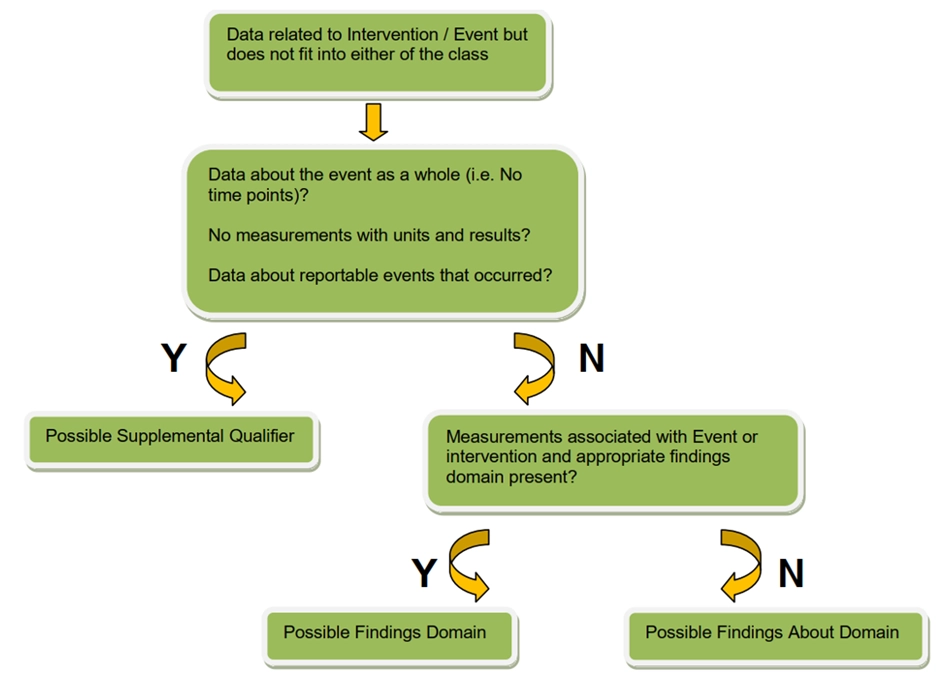

# Findings About

Зберігти файндінги навколо івентів, інтервеншинів, але які погано лягають в сап

## FA

**One record per finding, per object, per time point, per visit per subject**

Наприклад, якщо під час візиту збирається інформація про тяжкість adverse event декілька разів, то цю інформацію правильно було б зберігти в findings about датасет.

Ще один приклад, якщо у нас є якийсь adverse event, про який ми збираємо додаткову інформацію. Наприклад, для сипі ми ще збираємо діаметр.

| Змінна | Опис | Додаткова інформація |
| --- | --- | --- |
| FAOBJ | Разом з FATEST зберігає тему запису. Тобто FATEST чого цей файндінг | Значення повинне збігатися із значенням –TERM або –TRT |