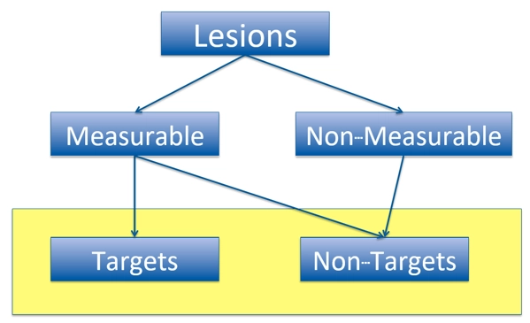

# Oncology

**Lesions** - утворення

**Target lesion** - це утворення, за яким слідкують найбільше. Обмеження: 2 таргети на орган і 5 таргетів в цілому

**Measurable** - утворення, за якими просто слідкують. Щоб утворення могли бути measurable треба, щоб:

- nodal: ≥ 15 mm по короткій осі
- non-nodal: ≥ 10 mm по найдовшому діаметру

**Non-measutable** - утворення, за якими слідкують якісно, тобто воно є чи ні.

- не таргети
- нові утворення

## Типи response

- **Complete response (CR)**
  - пацієнт гарно відповідає на лікування
  - пропали всі таргет утворення
  - всі лімфові вузли < 10 mm
- **Partial response (PR)**
  - мін. 30% зменшення в SD (сума діаметрів) порівняно з BSD
- **Progressive disease (PD)**
  - збільшення щонайменше на 20% (хоча б 5 мм) SD порівняно з NADIR
- **Stable disease (SD)**
  - немає якісних змін

**BSD** - baseline sum of diametres

**NADIR** - smallest sum of diametres

**Overall Response** буде будуватися на основі Target, Non-Target and New утвореннях.

## TU

Належить до класу **Findings**

Опис усіх утворень, що є у суб’єкта

**One record per identified tumor per subject per assessor**

| Змінна | Опис | Додаткова інформація |
| --- | --- | --- |
| **TULNKID** | Використовується для зв’язування з TR |  |
| **TUPORTOT** | Наскільки уражений орган |  |
| **TUMETHOD** | Метод, яким було ідентифіковано утворення |  |
| **TUACPTFL** | Флаг, який позначає запис, який ми беремо за остаточний | Це потрібно, тому що виміру одразу роблять 2 спеціаліста, і якщо у них велика розбіжність, то залучається третій. |

## TR

Описує характеристики утворень

**One record per tumor measurement / assessment per visit per subject per assessor**

Структурно не відрізняється від TU

## RS

Описує відповіді пацієнта на лікування

**One record per tumor measurement/ assessment per visit per subject per assessor**