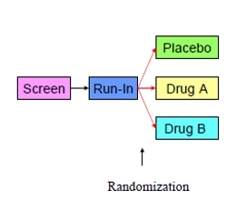

# Trial Design Domains

Описати дизайн стадії. Інформація в ці датасети приходить з протоколу

## TV

Описує заплановані візити

**One record per planned Visit per Arm** 

| Змінна | Опис | Додаткова інформація |
| --- | --- | --- |
| **TVSTRL** | За яких умов починається візит | Якщо в протоколі немає інформації, за яких умов починається візит, то нормально просто написати «N Days after First Day of Dosing» наприклад. |
| **TVENRL** | За яких умов закінчується візит |  |

Якщо у нас візит може відбутися в інтервал study days, тобто ми не знаємо точного дня, коли цей візит відбудеться, то ми можемо залишити VISITDY пустим

Також для побудови цього датасету є документи у Data Manager по запланованим study day.

ARM, ARMCD залишаються пустими, якщо візит однаковий для всіх treatment groups.

Unscheduled візити не включаються в цей датасет

## TA

Описати всі можливі treatment групи, які є в дослідженні

**One record per planned Element per Arm**

| Змінна | Опис | Додаткова інформація |
| --- | --- | --- |
| **TAETORD** | Числове значення елементу, щоб можна було відсортувати в хронологічному порядку |  |
| **ETCD** | Коротка назва елементу | Макс. 8 символів |
| **ELEMENT** | Опис елементу | Елемент - це фактично певний інтервал часу, на який може бути розділений ARM |
| **TABRANCH** | Умова, за яким суб’єкт може перейти з одного елемента на інший |  |
| **TATRANS** | Правило, за яким суб’єкт може перестрибнути з одного елемента в інший |  |

## TE

Описати кожний елемент, який є на дослідженні

**One record per planned Element**

На зображенні 3 treatment групи і 5 elements

## TI

Описує inclusion/exclusion критерії

**One record per I/E criterion**

IETEST може бути до 200 символів. Дуже часто, опис критерію вилазить за 200 символів, тоді треба буде його переформульовувати, скорочувати, видаляти зайві символи.

| Змінна | Опис | Додаткова інформація |
| --- | --- | --- |
| **TIRL** |  |  |
| **TIVERS** | Версія протоколу |  |

Якщо змінився якийсь критерій, то треба додати до датасету знову всі критерії, але вже з оновленою версією протоколу.

## TS

Загальний опис того, що буде відбуватися на дослідженні

**One record per trial summary parameter value**

| Змінна | Опис | Додаткова інформація |
| --- | --- | --- |
| **TSPARMCD** | Короткий опис параметру, про який буде інформація | Макс. 8 символів. Наприклад, AGEMIN, AGEMAX |
| **TSPARM** | Повний опис параметру | Макс. 40 символів |
| **TSVAL** | Фактичне значення параметру |  |
| **TSVALNF** | Значення, яке треба додати, в тому випадку, якщо TSVAL пустий |  |
| **TSVALCD** | Числовий код значення | Отримується або з control terminology, або з словників |
| **TSVCDREF** | Назва словника, з якого отримай код |  |
| **TSVCDVER** | Версія словника |  |

Посилання на всі необхідні TSPARMCD: <https://fda.report/media/136460/StudyDataTechnicalConformanceGuide_v4.5_March_FINAL.pdf>

Можливі значення TSPARMCD та звідки їх брати

| TITLE |  | Protocol |
| --- | --- | --- |
| OBJPRIM | Основна мета дослідження | Protocol |
| OBJSEC | Другорядна мета дослідження | Protocol |
| OUTMSPRI |  | Protocol |
| OUTMSSEC |  | Protocol |
| OUTMSEXP |  | Protocol |
| STOPRULE |  | Protocol |
| DCUTDESC |  | Protocol |
| PLANSUB |  | Protocol |
| ACTSUB |  | Protocol, ще з фактичних даних |
| NARMS |  | Protocol |
| RANDQT |  | Protocol |
| STRATFCT |  | Protocol |
| TRT |  | [UNII](https://precision.fda.gov/uniisearch/srs/unii/9100L32L2N) |
| CURTRT |  | [UNII](https://precision.fda.gov/uniisearch/srs/unii/9100L32L2N) |
| COMPTRT |  | [UNII](https://precision.fda.gov/uniisearch/srs/unii/9100L32L2N) |
| PCCLAS |  | [NDF-RT](https://ncit.nci.nih.gov/ncitbrowser/pages/vocabulary.jsf?dictionary=NDFRT) (старий словник) [MED-RT](https://ncit.nci.nih.gov/ncitbrowser/pages/vocabulary.jsf?dictionary=MED-RT) |
| SPONSOR |  | https://www.upik.de/de/upik_suche.cgi https://www.dnb.com/de-de/upik-en |
| INDIC |  | [SNOMED](https://ncit.nci.nih.gov/ncitbrowser/pages/vocabulary.jsf?dictionary=SNOMED%20Clinical%20Terms%20US%20Edition) |
| TDIGRP |  | [SNOMED](https://ncit.nci.nih.gov/ncitbrowser/pages/vocabulary.jsf?dictionary=SNOMED%20Clinical%20Terms%20US%20Edition) |
| REGID |  | http://www.clinicaltrials.gov/ |