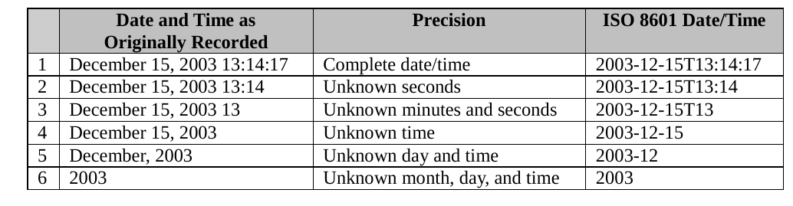
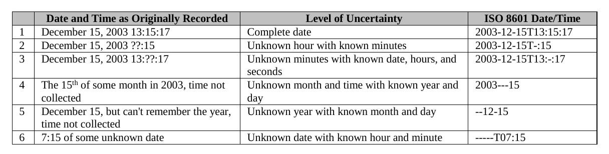
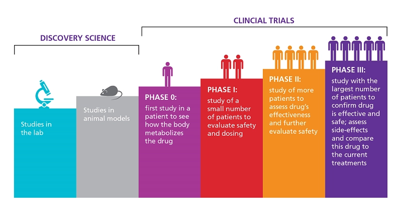
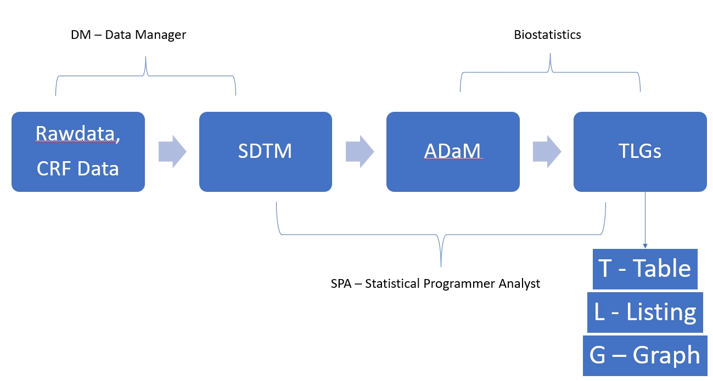

# Теорія

## Терміни

**Rawdata** - дані, які приходять з лікарень/сайтів.

**SDTM** - структуровані, стандартизовані сирі данні.

**ADaM** - аналіз датасет. Дані з SDTM, які підготовлені для аналізу.

**TLGs** - візуалізовані дані. Таблиці, лістинги, фігури.

**SDTM** - Standard Data Tabulation Model. Стандартизовані та структуровані сирі дані.

- SDTM - таблиця
- Variable (змінна) - колонка
- Record (запис) - рядок

**Domain** - це інформація, об’єднана навколо однієї теми.

**Dataset** - це представлення домену.

**Population** - це вибірка суб'єктів за певними критеріями.

## Типи змінних

### SDTM

- **Required**
  - має бути в датасеті, не може бути пустим
- **Expected**
  - має бути в датасеті, може бути пусти
- **Permissible**
  - може не бути в датасеті

### ADAM

- **Req = Required**
  - The variable must be included in the dataset

- **Cond = Conditionally required**
  - The variable must be included in the dataset in certain circumstances. Повина бути присутньою за деяким дизайном дослідження.

- **Perm = Permissible**
  - The variable may be included in the dataset, but is not required. Unless otherwise specified, all ADaM variables are populated as appropriate, meaning nulls are allowed

## Документи

**Protocol** - протокол дослідження, який включає всю інформацію про те як має проходити дослідження (Мета дослідження, режим прийому препарату, які аналізи проводити, коли їх потрібно проводити і т.д.).

Обов’язкові розділи протоколу для ознайомлення:

- **Study Design**
  - описує дизайн дослідження
- **Schedule of Assessments**
  - описує коли які аналізи/вимірювання необхідно проводити
- **Task related block**
  - конкретні задачі

**CRF** - форма, в яку лікарі заносять дані пацієнта. Містить питання, які лікар повинен спитати у пацієнта.

**aCRF** - анотована CRF, яка має підпис кожного з полів. Містить інформацію до якої змінної в SDTM потрапить кожне поле.

**Informed Consent** — документ, який підписує пацієнт на самому початку, де зазначається що буде відбуватися на дослідженні.

Три документа, які потрібна для створення SDTM:

- **Implementation Guide**

    <https://www.cdisc.org/standards/foundational/sdtmig>

- **Control Terminology**

    <https://datascience.cancer.gov/resources/cancer-vocabulary/cdisc-terminology>

- **Study Data Tabulation Model**

    <https://www.cdisc.org/standards/foundational/sdtm>

Документи для створення ADAM датасетів:

- **SAP**
  - Document that include all specific about analysis on study. Produced by Statistician.
- **Mock/Shell**
  - Template for outputs that need to be produced on study
- **ADaM IG**
  - Standard document(s) that describe structure of the dataset

## Дати ISO 8601

### Стадії кліничних досліджень

### Потік даних на дослідженні

